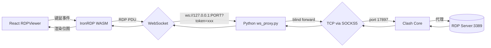
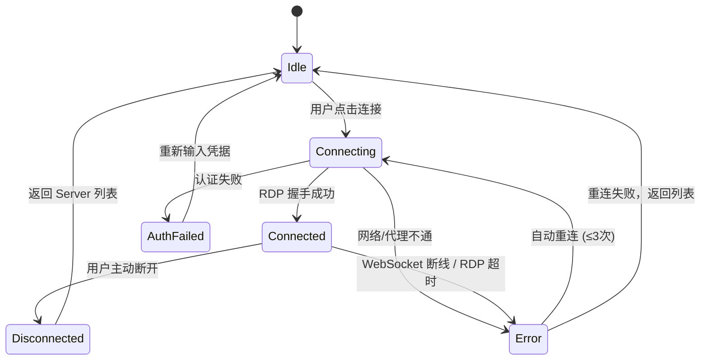

# NextDesk 架构升级：原生 IronRDP WASM 集成方案（v2 修订版）

## 概览与目标

使用 WebAssembly 原生 RDP 客户端（`ironrdp-wasm`）完全替代 `MultiDesk` 外挂方案，实现：
1. **跨平台支持**：移除对 Windows 专有二进制 `MultiDesk_chs.x64.dll` 及窗口劫持行为的依赖
2. **UI 深度融合**：RDP 桌面直接渲染在前端 `<canvas>` 内，可叠加原生 Web UI
3. **架构整洁化**：后端精简为 Clash 代理控制 + WebSocket 桥接服务

---

## 核心架构数据流

---

## Phase 0：最小化 PoC 验证（⚠️ 阻塞性前置步骤）

> [!CAUTION]
> 此阶段必须在任何代码改造之前完成。如果 PoC 失败，后续所有工作无意义。

### 目标
验证 `ironrdp-wasm` 能否通过 WebSocket 代理成功连接**启用了 NLA 的 Windows RDP 服务器**并渲染登录画面。

### 验证步骤

#### [NEW] `/tmp/poc/ws_proxy_poc.py`（~50行极简代理）
- 纯 `asyncio` + `websockets` 实现
- 接收 WS 连接 → 直连目标 RDP TCP:3389（暂不走 SOCKS5）
- Binary frame ↔ TCP byte 盲转

#### [NEW] `/tmp/poc/index.html`（独立测试页面）
- 加载 `ironrdp-wasm` npm 包
- `SessionBuilder` 连接 `ws://127.0.0.1:8765`
- 渲染到 `<canvas>`

### PoC 关键验证点

| 验证项 | 通过标准 | 失败后的 Plan B |
|--------|---------|---------------|
| WASM 加载 | 模块初始化无报错 | 检查 Vite/webpack WASM 配置 |
| WebSocket 连接 | 双向数据流畅通 | 检查 binary frame 处理 |
| **NLA/CredSSP** | **能完成认证握手** | **Python 后端代理层完成 NLA 协商后转交 session** |
| 画面渲染 | 看到 Windows 登录/桌面 | 检查 Canvas 2D Context 配置 |

> [!IMPORTANT]
> NLA/CredSSP 是最大风险点。大多数 Windows Server 2012+ 默认强制 NLA。
> IronRDP 提供 `enableCredssp(enable)` 扩展来控制此行为。
> 如果 WASM 环境中 CredSSP 不可用，Plan B 是在 Python 后端用原生 TCP 完成认证协商后再桥接。

---

## Phase 1：后端基础设施改造

### NPM 包选择策略

> [!IMPORTANT]
> 必须在此阶段明确使用哪个包：

| 包名 | 来源 | 状态 | 推荐 |
|------|------|------|------|
| `ironrdp-wasm` v1.0.1 | 社区 (zxdong262) | ✅ 已发布在 npm | **首选**（已确认可用） |
| `@devolutions/ironrdp-web` | 官方 Devolutions | ❓ 需确认是否发布 | 若存在则优先 |
| 自行构建 | IronRDP `web-client/` 源码 | 需要 Rust + wasm-pack | 最后手段 |

**决策路径**：先 `npm info @devolutions/ironrdp-web` → 存在则用官方 → 否则用 `ironrdp-wasm`。

### [NEW] `backend/core/ws_proxy.py`

`WsProxyServer` 类：
- `asyncio` + `websockets` 监听**随机可用端口**
- 连接参数：`ws://127.0.0.1:{port}/?token={one_time_token}`
- **安全机制**：后端生成一次性 token，前端携带 token 连接，验证后销毁，防止端口被本机其他进程滥用
- 内部通过 `PySocks` 连接 Clash SOCKS5 (端口 17897)
- **Binary blind-forward**：WebSocket binary frame ↔ TCP bytes 零拷贝转发，不做任何编解码

### [MODIFY] [api.py](file:///Users/yuu/Downloads/vibe_coding/rdp_project/NextDesk/backend/api.py)
- `Api` 类增加 `WsProxyServer` 生命周期管理
- 新增 `get_ws_proxy_info()` → 返回 `{port, token}` 给前端
- 引擎启停时一并管理 WS Proxy

### [MODIFY] [launcher.py](file:///Users/yuu/Downloads/vibe_coding/rdp_project/NextDesk/backend/core/launcher.py)
- 删除 `_start_multidesk`、`_hijack_window_title` 等 Windows 专用代码
- 仅保留 Clash Core 生命周期管控

### [MODIFY] [config_gen.py](file:///Users/yuu/Downloads/vibe_coding/rdp_project/NextDesk/backend/core/config_gen.py)
- 保留 MultiDesk 配置生成存根（过渡期），标记 `@deprecated`

---

## Phase 2：前端依赖与 WASM 配置

### [MODIFY] [package.json](file:///Users/yuu/Downloads/vibe_coding/rdp_project/NextDesk/frontend/package.json)
- 添加 `ironrdp-wasm`（或确认后的官方包）
- 添加 `vite-plugin-wasm` + `vite-plugin-top-level-await`

### [MODIFY] [vite.config.ts](file:///Users/yuu/Downloads/vibe_coding/rdp_project/NextDesk/frontend/vite.config.ts)
- 引入 WASM 插件，确保 `.wasm` 文件作为静态资源正确打包
- 配置 `optimizeDeps.exclude` 排除 WASM 包避免预构建报错

---

## Phase 3：前端 RDPViewer 组件与连接生命周期

### [NEW] `frontend/src/components/RdpViewer.tsx`

**核心功能**：
- 接收 `host`, `port`, `credentials` 参数
- 全屏 `<canvas>` + 悬浮工具栏（断开/全屏/返回）
- 异步加载 `ironrdp-wasm`，创建 `SessionBuilder`
- 键鼠事件 → IronRDP 扫描码映射

**连接状态机**（审查补充）：

**错误处理矩阵**（审查补充）：

| 错误场景 | 检测方式 | 用户侧行为 |
|---------|---------|-----------|
| WS 断线 | `WebSocket.onclose` | Toast 提示 + 自动重连 ≤3次 |
| RDP 认证失败 | IronRDP `IronError` | 弹出凭据重输入对话框 |
| Clash 代理不通 | WS Proxy 连接 SOCKS5 失败 | 提示"请先启动引擎" |
| 会话超时 | RDP disconnect PDU | 提示"远程会话已结束" |
| WASM 加载失败 | `import()` reject | 提示"组件加载失败，请刷新" |

### [MODIFY] [App.tsx](file:///Users/yuu/Downloads/vibe_coding/rdp_project/NextDesk/frontend/src/App.tsx)
- Server 卡片增加"连接"按钮 → 挂载 `RdpViewer` 全屏组件
- `rdp-session` 作为独立页面层级，断开后退回 Servers 界面

---

## User Review Required

> [!WARNING]
> **重大架构重构**，需确认以下事项：
> 1. **NLA/CredSSP 风险**：如果 PoC 阶段验证 WASM 中 CredSSP 不可用，是否接受 Plan B（后端代理认证）增加的复杂度？
> 2. **功能降级**：新方案暂不支持音频转发、USB 重定向、智能卡。仅支持剪贴板文本传递和基本图形。是否可接受？
> 3. **多会话**：是否需要支持同时打开多个 RDP 标签？（影响 WS Proxy 和前端路由设计）

---

## Verification Plan

### Phase 0 PoC 验证
1. 运行 `/tmp/poc/ws_proxy_poc.py`
2. 浏览器打开 `/tmp/poc/index.html`
3. 连接真实 Windows RDP 服务器（NLA 启用）
4. ✅ 看到登录画面 = 方案可行 → 进入 Phase 1

### 集成测试
1. `python main.py` 启动完整应用
2. 前端 Servers 列表点击连接 → 验证 RDP 画面渲染
3. 键盘输入（字母/快捷键）正确性
4. 断开连接 → 验证 WS/TCP 链路完全释放，无僵尸线程
5. 异常场景：拔网线/关闭 Clash → 验证错误提示和重连逻辑
