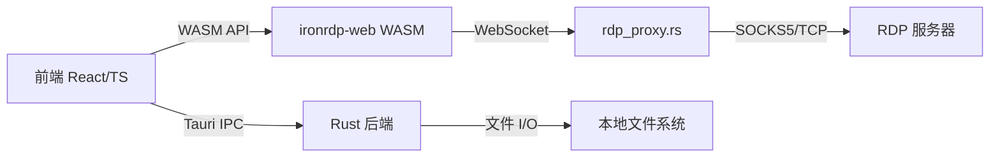

# RDPDR 文件夹共享实现 — 差距分析与计划

## 🏗️ 当前架构



**关键发现**：`session.rs:L999` 中 `connector.attach_static_channel(CliprdrClient::new(...))`
CLIPRDR 通道就是在 WASM 中注册的。**RDPDR 也可以用同样的方式注册**。

## ⚡ 修正后的方案：WASM 中注册 RDPDR（无需迁移连接）

> [!IMPORTANT]
> 之前认为需要将 RDP 连接迁移到 Rust 后端（~1000 行），但代码审查发现 **WASM 已经有 SVC 通道注册机制**，可以直接添加 RDPDR 通道，通过 JS 回调桥接到 Tauri 的文件 I/O。

## 需要完善的部分

### ✅ 已完成

| 组件 | 文件 | 状态 |
|------|------|------|
| 文件夹扫描工具 | `rdpdr_backend.rs:rdpdr_scan_folder` | ✅ 可直接复用 |
| 文件读取 | `rdpdr_backend.rs:clipboard_read_file` | ✅ 可直接复用 |
| 文件写入 | `rdpdr_backend.rs:clipboard_write_file` | ✅ 可直接复用 |
| Tauri 命令注册 | `lib.rs:L587-591` | ✅ 已注册 |

---

### ❌ 缺失部分（共 5 层）

#### 第 1 层：WASM RDPDR 通道注册

**位置**: `ironrdp-web/src/session.rs` (~L999)

需要添加：
```rust
// Alongside CliprdrClient registration:
let rdpdr = Rdpdr::new(Box::new(wasm_rdpdr_backend), computer_name)
    .with_drives(Some(initial_drives));
connector.attach_static_channel(rdpdr);
```

**前提**：`ironrdp-web/Cargo.toml` 需要添加 `ironrdp-rdpdr` 依赖

---

#### 第 2 层：WASM RdpdrBackend 实现

**创建新文件**: `ironrdp-web/src/rdpdr.rs`

参考现有的 `clipboard.rs`（它实现了 `CliprdrBackend` trait），需要：
- 实现 `RdpdrBackend` trait
- 通过 JS 回调桥接到 Tauri 的文件 I/O 命令
- 处理 `ServerDriveIoRequest`（目录列举、文件读/写/查询）

关键 trait（来自 `ironrdp-rdpdr/src/backend/mod.rs`）：
```rust
pub trait RdpdrBackend: Send {
    fn handle_server_device_announce(&mut self, ...) -> PduResult<Vec<SvcMessage>>;
    fn handle_drive_io_request(&mut self, ...) -> PduResult<Vec<SvcMessage>>;
}
```

**难点**：WASM 不能同步访问文件系统，需用 JS→Tauri→文件系统异步链路

---

#### 第 3 层：WASM ↔ JS 回调接口

**修改**: `ironrdp-web/src/session.rs` 的 `SessionBuilder`

参考 `clipboardBackend` 的模式，添加：
- `driveIoCallback(operation, path, data)` — 供 WASM 回调 JS
- `SessionBuilder::rdpdrEnabled(bool)` — 启用 RDPDR
- `SessionBuilder::sharedFolders(string[])` — 共享文件夹列表

---

#### 第 4 层：前端 JS 桥接

**修改**: `RdpManager.tsx` 和/或 `RdpConnectDialog.tsx`

- 在 `SessionBuilder` 链路中传入共享文件夹配置
- 实现 drive I/O 回调（调用 Tauri 命令 `rdpdr_scan_folder`、`clipboard_read_file` 等）
- 连接设置 UI：文件夹选择器（使用 `tauri-plugin-dialog`）

---

#### 第 5 层：连接设置 UI

**修改**: `RdpConnectDialog.tsx` 或 `NewConnectionDialog.tsx`

- 添加"共享文件夹"选项
- 文件夹选择器（系统原生对话框）
- 保存共享文件夹配置到连接数据中

---

## 依赖关系

```
第 5 层 UI → 第 4 层 JS → 第 3 层 WASM API → 第 2 层 Backend → 第 1 层 通道注册
                                                    ↓
                                    已有: rdpdr_backend.rs 文件 I/O
```

## 风险评估

| 风险 | 等级 | 缓解 |
|------|------|------|
| WASM 中 async 文件 I/O | 🟡 中 | 参考 clipboard.rs 的异步回调模式 |
| ironrdp-rdpdr WASM 兼容性 | 🟡 中 | 需验证 crate 无 std::fs 依赖 |
| WASM 重编译 | 🟢 低 | 已有编译流水线 |
| 协议正确性 | 🟡 中 | 参考 ironrdp-client 示例 |

## 工期预估

| 层级 | 预估 |
|------|------|
| 第 1 层 通道注册 | 0.5 天 |
| 第 2 层 Backend 实现 | 2-3 天 |
| 第 3 层 WASM API | 1 天 |
| 第 4 层 JS 桥接 | 1 天 |
| 第 5 层 UI | 0.5 天 |
| **总计** | **5-6 天** |
