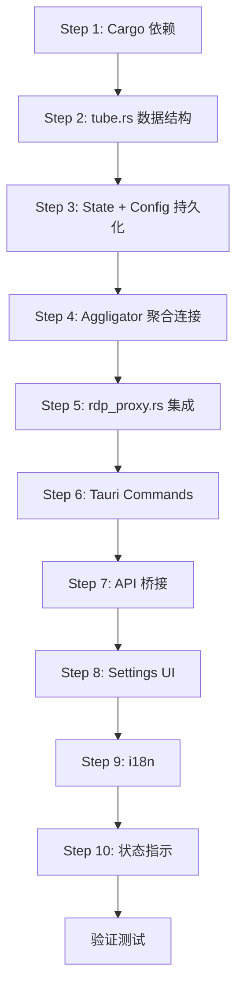

# Tube Mode 详细实施计划

## 一、你需要准备的内容

### VPS 服务器
- **数量**：美国 1 台 + 亚洲 1 台（按需）
- **位置**：和 RDP 服务器同区域/同机房
- **配置**：最低 1 核 512MB，Ubuntu 22.04+
- **域名**：`tube-us.yourdomain.com` / `tube-asia.yourdomain.com`
- **防火墙**：开放 TCP 端口 9000

### VPS 部署（每台 VPS 执行一次）

```bash
# 1. 安装 Rust
curl --proto '=https' --tlsv1.2 -sSf https://sh.rustup.rs | sh
source ~/.cargo/env

# 2. 安装 agg-tunnel
cargo install aggligator-util

# 3. 启动调度器（根据你的 RDP 服务器地址修改）
agg-tunnel server --listen 0.0.0.0:9000 --target <RDP服务器IP>:3389

# 4. 生产环境用 systemd 管理（开机自启+自动重启）
sudo tee /etc/systemd/system/agg-tunnel.service << 'EOF'
[Unit]
Description=Aggligator Tunnel Server
After=network.target

[Service]
ExecStart=/root/.cargo/bin/agg-tunnel server --listen 0.0.0.0:9000 --target <RDP_IP>:3389
Restart=always
RestartSec=5

[Install]
WantedBy=multi-user.target
EOF
sudo systemctl enable --now agg-tunnel
```

> [!WARNING]
> 每个 RDP 目标需要一个 `agg-tunnel` 实例（不同端口）。
> 多个 RDP 目标示例：端口 9000→RDP-A:3389，端口 9001→RDP-B:3389

---

## 二、代码实施步骤

### Step 1：添加 Cargo 依赖

**文件**：[Cargo.toml](file:///Users/yuu/Downloads/vibe_coding/rdp_project/NextDesk/src-tauri/Cargo.toml)

```diff
+aggligator = "0.9"
+aggligator-transport-tcp = "0.2"
```

---

### Step 2：定义 Tube Mode 数据结构

**文件**：[NEW] [tube.rs](file:///Users/yuu/Downloads/vibe_coding/rdp_project/NextDesk/src-tauri/src/tube.rs)

```rust
// Tube Mode 配置和核心逻辑
pub struct TubeConfig {
    pub enabled: bool,
    pub dispatchers: Vec<Dispatcher>, // 调度器列表
    pub link_count: usize,            // 同时使用的链路数（默认3）
}

pub struct Dispatcher {
    pub name: String,       // "美国", "亚洲"
    pub address: String,    // "tube-us.example.com:9000"
}
```

---

### Step 3：扩展 AppState 和配置持久化

**文件**：[state.rs](file:///Users/yuu/Downloads/vibe_coding/rdp_project/NextDesk/src-tauri/src/state.rs) + [config.rs](file:///Users/yuu/Downloads/vibe_coding/rdp_project/NextDesk/src-tauri/src/config.rs)

- `AppState` 新增 `tube_config: Arc<Mutex<TubeConfig>>`
- `SavedConfig` 新增 `tube` 字段，序列化到 `config.json`

---

### Step 4：实现 Aggligator 聚合连接（核心）

**文件**：[tube.rs](file:///Users/yuu/Downloads/vibe_coding/rdp_project/NextDesk/src-tauri/src/tube.rs)

```rust
/// 通过 Aggligator 建立多链路聚合连接
pub async fn connect_tube(
    dispatcher_addr: &str,  // 调度器地址
    socks_port: u16,        // Clash SOCKS5 端口
    link_count: usize,      // 链路数
) -> Result<impl AsyncRead + AsyncWrite> {
    // 1. 创建 Aggligator 出站连接
    let (task, control, io) = aggligator::connect(Cfg::default()).await;
    tokio::spawn(task.run());

    // 2. 创建 N 条链路（每条走不同代理节点）
    for i in 0..link_count {
        let tcp = Socks5Stream::connect(
            format!("127.0.0.1:{socks_port}"),
            dispatcher_addr,
        ).await?;
        control.add_link(tcp.into_inner()).await;
    }

    // 3. 后台监控链路健康
    tokio::spawn(monitor_links(control));

    Ok(io)
}
```

---

### Step 5：修改 rdp_proxy.rs 支持 Tube Mode

**文件**：[rdp_proxy.rs](file:///Users/yuu/Downloads/vibe_coding/rdp_project/NextDesk/src-tauri/src/rdp_proxy.rs)

改动点：
1. `start_proxy()` — 新增 `TubeConfig` 参数
2. `handle_inner()` — 当 Tube Mode 开启时：
   - 第 166 行：`connect_to_dest()` 替换为 `tube::connect_tube()`
   - 第 176-198 行：TLS 握手改为通过聚合流发送
   - 第 200-221 行：relay 阶段使用聚合流

---

### Step 6：注册 Tauri Commands

**文件**：[lib.rs](file:///Users/yuu/Downloads/vibe_coding/rdp_project/NextDesk/src-tauri/src/lib.rs)

新增命令：
- `get_tube_config` — 获取 Tube Mode 配置
- `set_tube_config` — 保存 Tube Mode 配置
- `test_tube_dispatcher` — 测试调度器连通性

第 768 行 `start_proxy` 调用处传入 TubeConfig。

---

### Step 7：前端 API 桥接

**文件**：[api.ts](file:///Users/yuu/Downloads/vibe_coding/rdp_project/NextDesk/frontend/src/api.ts)

```typescript
getTubeConfig: () => invoke<TubeConfig>('get_tube_config'),
setTubeConfig: (config: TubeConfig) => invoke('set_tube_config', { config }),
testTubeDispatcher: (addr: string) => invoke<boolean>('test_tube_dispatcher', { addr }),
```

---

### Step 8：前端 Settings UI

**文件**：[App.tsx](file:///Users/yuu/Downloads/vibe_coding/rdp_project/NextDesk/frontend/src/App.tsx)

在 Settings 页面新增 Tube Mode 配置区：
- Toggle 开关（启用/禁用）
- 调度器列表（名称 + 地址，支持添加/删除）
- 连通性测试按钮（对每个调度器）
- 链路数量选择（2/3/5）

---

### Step 9：i18n 翻译

**文件**：[translations.ts](file:///Users/yuu/Downloads/vibe_coding/rdp_project/NextDesk/frontend/src/i18n/translations.ts)

新增 Tube Mode 相关的中英文翻译。

---

### Step 10：RDP 连接状态指示

**文件**：[RdpManager.tsx](file:///Users/yuu/Downloads/vibe_coding/rdp_project/NextDesk/frontend/src/components/RdpManager.tsx)

当 Tube Mode 启用时，在 RDP 状态栏显示：
- 🟢 Tube Mode 图标
- 活跃链路数量（如 "3/3 links"）

---

## 三、验证步骤

| 步骤 | 验证内容 | 方法 |
|------|---------|------|
| 1 | Cargo 依赖编译 | `cargo check` |
| 2 | 完整构建 | `cargo build` |
| 3 | 开发模式启动 | `npx tauri dev` |
| 4 | VPS 连通性 | Settings 页面测试按钮 |
| 5 | Tube Mode RDP 连接 | 连接 RDP 确认正常 |
| 6 | 容错测试 | 手动断开一个代理节点，确认不断连 |

---

## 四、实施顺序



> [!IMPORTANT]
> **Step 1-6 是后端核心**，完成后就可以通过命令行测试 Tube Mode。
> **Step 7-10 是前端 UI**，让用户可以在界面上配置和使用。
> **验证测试需要你的 VPS 已部署 `agg-tunnel`。**
