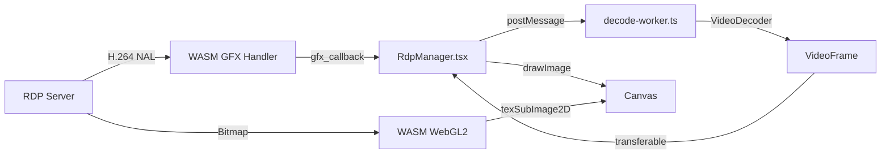

# Phase 3-4 实现总结

## 架构概览

## 新增文件

| 文件 | 作用 |
|------|------|
| `h264-decoder.ts` | WebCodecs VideoDecoder 封装（主线程 fallback） |
| `decode-worker.ts` | Worker 线程 H.264 解码（Phase 4 性能优化） |

## 修改文件

| 文件 | 变更 |
|------|------|
| `session.rs` | 添加 `gfx_callback` extension_match 暴露给 JS |
| `RdpManager.tsx` | 注册 gfx_callback + Worker 通信 + 断连清理 |

## 数据流

1. **Bitmap 路径**（已有）：Server → WASM → WebGL2 `texSubImage2D` → Canvas
2. **H.264 路径**（新增）：Server → WASM GFX → `gfx_callback` → Worker `VideoDecoder` → `VideoFrame` (transferable) → Canvas `drawImage`

## 关键设计决策

- **双路径共存**：Bitmap 和 H.264 共用同一 canvas，GFX 通道可选
- **Worker 解码 + 主线程渲染**：VideoFrame 零拷贝传回主线程绘制
- **优雅降级**：WebCodecs 不可用时跳过 GFX，bitmap 路径正常工作
- **自动清理**：会话结束时关闭 decoder + 终止 worker
