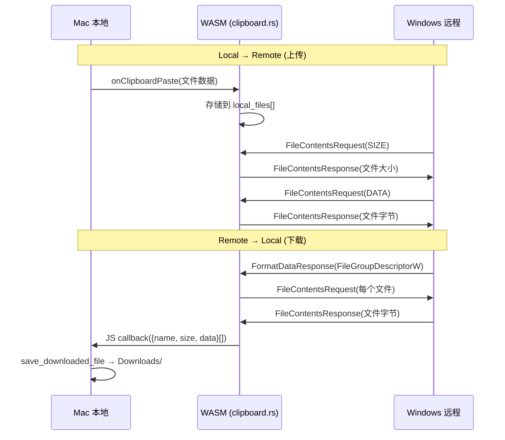

# RDP 文件传输第二阶段 — Walkthrough

## 目标
实现文件**字节数据**的双向传输（第一阶段仅传输文件列表元数据）。

## 架构设计

## 修改的文件

### [clipboard.rs](file:///Users/yuu/Downloads/vibe_coding/rdp_project/IronRDP/crates/ironrdp-web/src/clipboard.rs)
- 新增 `local_files`, `remote_file_descriptors`, `remote_file_data`, `pending_file_streams`, `next_stream_id` 字段
- `handle_local_clipboard_changed`: 提取文件二进制数据存入 `local_files`
- `FileContentsRequest` handler: 从 `local_files` 直接响应 SIZE/DATA 请求
- `process_remote_data_response`: 解码文件列表后自动发送 `FileContentsRequest`
- `FileContentsResponse` handler: 聚合数据，全部接收后以 JSON 回调 JS

### [RdpManager.tsx](file:///Users/yuu/Downloads/vibe_coding/rdp_project/NextDesk/frontend/src/components/RdpManager.tsx)
- `fileContentsResponseCallback`: 解析 `{name, size, data}[]` 数组，调用 `save_downloaded_file`

### [rdpdr_backend.rs](file:///Users/yuu/Downloads/vibe_coding/rdp_project/NextDesk/src-tauri/src/rdpdr_backend.rs)
- 新增 `save_downloaded_file` 命令，保存到用户 Downloads 目录

### [lib.rs](file:///Users/yuu/Downloads/vibe_coding/rdp_project/NextDesk/src-tauri/src/lib.rs)
- 注册 `save_downloaded_file` 命令
