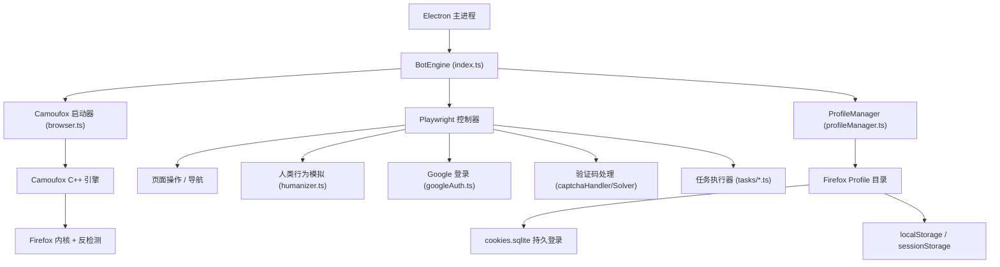

# 🔍 指纹浏览器架构审查报告

## 审查结论

**✅ 是的 — 当前架构构成一个完整的指纹浏览器方案。**

---

## 1. 旧依赖清除验证

| 检查项 | grep 结果 |
|--------|:---------:|
| `from 'puppeteer` | ✅ 零 |
| `ghost-cursor` | ✅ 零 |
| `chrome-remote-interface` | ✅ 零 |
| `page.$()` (deprecated) | ✅ 零 |
| CDP 协议调用 | ✅ 零 |

> **100% 清除，无任何 Chrome/Puppeteer 残留代码。**

---

## 2. 架构分层

---

## 3. Profile 持久化 ✅

| 功能 | 文件 | 状态 |
|------|------|:---:|
| Profile 目录创建 | `profileManager.ts` → `getUserDataDir()` | ✅ |
| Profile 目录删除 | `profileManager.ts` → `deleteUserDataDir()` | ✅ |
| Profile 大小统计 | `profileManager.ts` → `getProfileSize()` | ✅ |
| 缓存清理 (Firefox) | `profileManager.ts` → `clearProfileCache()` | ✅ |
| 旧 Chrome 数据清理 | `profileManager.ts` → `cleanupLegacyChromeData()` | ✅ |
| Profile 锁检测 (Firefox) | `browser.ts` → `isProfileInUse()` | ✅ |
| Cookie 持久化 | `cookies.sqlite` (Firefox 原生) | ✅ |
| Cookie 状态检测 | `index.ts` L188 → `cookies.sqlite` | ✅ |
| `user_data_dir` 传入 Camoufox | `browser.ts` L116 | ✅ |

**Profile 路径**: `{electron userData}/browser-profiles/profile_{sha256(accountId).slice(0,16)}/`

> 每个 Google 账户拥有独立 Firefox profile，登录状态通过 `cookies.sqlite` 持久化。关闭浏览器后再次启动同一账户 → **自动恢复登录态，无需重新登录**。

---

## 4. 反检测能力 ✅

| 能力 | 实现层 | 代码位置 |
|------|--------|---------|
| 浏览器指纹伪装 | Camoufox C++ | 引擎内置 |
| Navigator/Screen 属性 | Camoufox C++ | 引擎内置 |
| WebGL 指纹 | Camoufox C++ | 引擎内置 |
| WebRTC 阻断 | `block_webrtc: true` | `browser.ts` L122 |
| GeoIP 自动匹配 | `geoip: true` | `browser.ts` L118 |
| 鼠标移动拟人 | `humanize: 1.5` | `browser.ts` L120 |
| Locale/语言 | `locale: ['en-US', 'en']` | `browser.ts` L121 |
| 打字拟人 | Playwright `keyboard.type` + 随机延迟 | `humanizer.ts` L44-58 |
| 点击拟人 | `locator.click({ delay })` | `humanizer.ts` L22-41 |
| 滚动拟人 | `mouse.wheel` + 随机方向/幅度 | `humanizer.ts` L61-69 |

---

## 5. 自动化流程链路 ✅

| 步骤 | API | 文件 |
|------|-----|------|
| 启动浏览器 | `Camoufox()` | `browser.ts` |
| 创建页面 | Playwright `context.newPage()` | `browser.ts` |
| 导航 | `page.goto()` | 各 task 文件 |
| 元素定位 | `page.locator()` | 全部已迁移 |
| 等待状态 | `page.waitForLoadState()` | 全部已修复 |
| Google 登录 | Playwright `locator` + `evaluate` | `googleAuth.ts` |
| 验证码检测 | `page.locator().count()` | `captchaHandler.ts` |
| 验证码求解 | `element.screenshot()` → base64 | `captchaSolver.ts` |
| reCAPTCHA v3 | `page.evaluate()` (对象参数) | `recaptcha.ts` |
| 任务执行 | 各 TaskExecutor | `tasks/*.ts` |

---

## 6. 与商业指纹浏览器对比

| 特性 | AYCD (当前) | Multilogin / AdsPower |
|------|:-----------:|:---------------------:|
| 独立 Profile | ✅ | ✅ |
| 浏览器指纹伪装 | ✅ (Camoufox C++) | ✅ (自研) |
| WebRTC 泄露防护 | ✅ | ✅ |
| 代理集成 | ✅ (含 SOCKS5 认证) | ✅ |
| GeoIP 自动匹配 | ✅ | ✅ |
| Cookie 持久化 | ✅ | ✅ |
| 行为拟人化 | ✅ (基础) | ⚠️ (更高级) |
| GUI Profile 管理 | ⚠️ (基础) | ✅ (完善) |
| 多平台指纹自定义 | ❌ | ✅ |
| Canvas/WebGL 指纹参数调整 | ❌ (Camoufox 自动) | ✅ (手动配置) |

---

## 7. ⚠️ 发现的问题

### 问题 1: `switchBrowserToVisible` 签名未更新

[browser.ts L252-258](file:///Users/yuu/Downloads/vibe_coding/aycd/aycd-project/src/bot-engine/browser.ts#L252-L258) — 参数仍为 `Browser` 类型，应改为 `Browser | BrowserContext`。

### 问题 2: `launchVanillaBrowser` 缺少反检测参数

[browser.ts L165-170](file:///Users/yuu/Downloads/vibe_coding/aycd/aycd-project/src/bot-engine/browser.ts#L165-L170) — 相比 `launchBrowser`，缺少 `humanize`, `locale`, `block_webrtc`, `enable_cache`，意味着通过 vanilla 路径启动的浏览器**没有完整反检测**。

### 问题 3: `cleanupLegacyChromeData()` 未自动调用

函数已定义但没有触发点 — 旧 Chrome 数据不会被自动清除。
